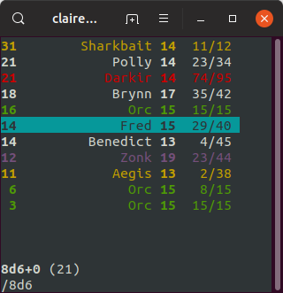

# TPK
A simple D&amp;D combat tracker, made originally for UNSW HS1917.

# Build
Clone this git repository then ensure you have ncurses installed before running:
```
$ make tpk
```
Run the program with
```
$ ./tpk
```
# Usage
The default controls are as follows:
    - `j` - Next actor.
    - `k` - Previous actor.
    - `i` - Insert a new actor. The program asks for input of form: `NAME` `INITIATIVE` `AC` `HP` `MAX_HP`. The `MAX_HP` field is optional, and will be set to `HP` if left out.
    - `d` - Delete an existing actor.
    - `e` - Edit an existing actor. See above.
    - `]` - Swap with next actor. Used to rearrange actors with equal initiative scores.
    - `[` - Swap with previous actor. See above.
    - `+` - Heal actor. The program asks for an integer, and heals the selected actor.
    - `-` - Hurt actor. The program asks for an integer, and hurts the selected actor.
    - `=` - Set actor HP. The program asks for an integer, and sets the currently selected actor's HP.
	- `c` - Set actor colour. The program asks for an integer corresponding to a terminal colour (black, red, green, yellow, blue, magenta, cyan, white).  
    - `/` - Roll a dice. The program will ask for input as a standard dice expression. Currently only `AdX+C` is supported.

All controls can be configured in [main.c](https://github.com/ShunyaoLiang/tpk/blob/master/main.c#L52).
